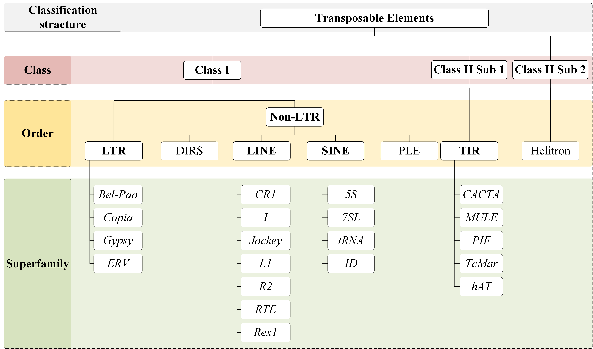

# BERTE
This repository includes the implementations of BERTE from:

**BERTE: High-precision hierarchical classification of transposable elements based on transfer learning method with BERT and CNN**

# Introduction
Transposable Elements (TEs) are abundant repeat sequences found in living organisms. They play a pivotal role in biological evolution and gene regulation and are intimately linked to human diseases. Existing TE classification tools can classify classes, orders, and superfamilies concurrently, but they often struggle to effectively extract sequence features. This limitation frequently results in subpar classification results, especially in hierarchical classification. To tackle this problem, we introduced BERTE, a tool for TE hierarchical classification. BERTE encoded TE sequences into distinctive features that consisted of both attentional and cumulative k-mer frequency information. By leveraging the multi-head self-attention mechanism of the pre-trained BERT model, BERTE transformed sequences into attentional features. Additionally, we calculated multiple k-mer frequency vectors and concatenate them to form cumulative features. Following feature extraction, a parallel Convolutional Neural Network (CNN) model was employed as an efficient sequence classifier, capitalizing on its capability for high-dimensional feature transformation. 

We evaluated BERTE’s performance on filtered datasets collected from 12 eukaryotic databases. Experimental results demonstrated that BERTE could improve the F1-score at different levels by up to 21% compared to current state-of-the-art methods. In general, BERTE classifies TE sequences with greater precision. 

**bioRxiv 2024**

[](<https://www.biorxiv.org/content/10.1101/2024.01.28.577612v1>)

## Method overview


## TE hierarchical classification structure


# Requirement
BERTE runs with a conda virtual environment
```Bash
conda create -n BERTE python=3.8.1
conda activate BERTE
```
## Use terminal
**Package information**

\(Verified with NVIDIA 4090 GPU, running tensorflow using

conda install cudnn==8.9.2.26 and conda install cudatoolkit==11.8.0\)

```Bash
pip install tensorflow==2.6.0
pip install tensorflow-gpu==2.6.0
pip install tensorflow-estimator==2.6.0

pip install keras==2.6.0
pip install keras-bert==0.89.0

pip install scikit-learn==1.3.2
pip install numpy==1.19.2
pip install scipy==1.9.3
pip install pandas==1.1.4

pip install h5py==3.1.0
pip install Protobuf==3.19.6
pip install Jsonlines==2.0.0
pip install bio==1.6.0
```
## Use requirements.txt
```Bash
pip install -r requirements.txt
```

# Feature Extraction
First extract the zip to \<your directory\>
```Bash
cd <directory where you store BERTE-main.zip>
unzip BERTE-main.zip
cd BERTE-main/
mkdir working_files/
```

The following usage is exemplified by the demo_SINE.fasta data \(which has been filtered for similarity\)

## Feature extraction module based on BERT
■ Enter the directory to generate k-mer
```Bash
cd ./Kmer_pre-processing
```

■ Truncate sequences in FASTA files by keeping only the both ends of the sequences (executed for 4-mer, 5-mer, 6-mer)
```Python
python seq_bothend_truncate.py ../demo_data/demo_SINE.fasta 506  # Truncate 506bp to generate 4-mer sequence both end fragments with stride 1
python seq_bothend_truncate.py ../demo_data/demo_SINE.fasta 508  # Truncate 508bp to generate 5-mer sequence both end fragments with stride 1
python seq_bothend_truncate.py ../demo_data/demo_SINE.fasta 510  # Truncate 510bp to generate 6-mer sequence both end fragments with stride 1
```

`seq_bothend_truncate.py`: Truncate sequences in a FASTA file by keeping only the both ends of the sequences

***Usage***: python seq_bothend_truncate.py \<input_fasta_file\> \<max_length\>

***Output***: The fasta file after truncation, with filename adding \<max_length\>. E.g. demo_SINE_506bp.fasta, demo_SINE_508bp.fasta, demo_SINE_510bp.fasta

***Arguments***:

  - \<input_fasta_file\>: Path to the input FASTA file.
  - \<max_length\>: Maximum length of the truncated sequences.


■ Generate k-mer count using Horner's rule (in this step generates both end 4-mer, 5-mer, 6-mer count for BERT)
```Python
python seq_to_kmercount_horner.py ../demo_data/demo_SINE_506bp.fasta 4 1 # Generate 4-mer count for both end of the sequences using Horner's rule, with stride 1
python seq_to_kmercount_horner.py ../demo_data/demo_SINE_508bp.fasta 5 1 # Generate 5-mer count for both end of the sequences using Horner's rule, with stride 1
python seq_to_kmercount_horner.py ../demo_data/demo_SINE_510bp.fasta 6 1 # Generate 6-mer count for both end of the sequences using Horner's rule, with stride 1
```

`seq_to_kmercount_horner.py`: Generate k-mer count using Horner's rule (in this step generates both end k-mer count for BERT)

***Usage***: seq_to_kmercount_horner.py [-h] [--is_full_length] fasta_file k stride

***Output***: superfamily pickle file, k-mer fragment json and txt files, k-mer count pickle file, full header file.

***Positional arguments***:
  - \<fasta_file\>: Input FASTA file containing sequences
  - \<k\>: Length of k-mers to generate
  - \<stride\>: Stride for k-mer generation

***Options***:
  - \-h, --help: Show this help message and exit
  - \-\-is_full_length: Generate full-length k-mers

■ Enter the directory to generate BERT \[CLS\] token embedding
```Bash
cd ../BERT_feature_extraction
```

■ Generating token embedding from pre-trained BERT models, using both end k-mer fragments as input.
```Python
CUDA_VISIBLE_DEVICES=0 python extract_features_tf2_cls.py \
    --input_file=../demo_data/demo_SINE_506bp_bothend_kmer_fragments.txt \
    --output_file=./demo_SINE_506bp_bothend_kmer_fragments_cls.jsonl \
    --vocab_file=./BERTMini/kmer_vocab.txt \
    --bert_config_file=./BERTMini/bert_config.json \
    --init_checkpoint=./BERTMini/bert_model.ckpt.index \
    --do_lower_case=False \
    --layers=-1 \
    --max_seq_length=503 \
    --batch_size=16

CUDA_VISIBLE_DEVICES=0 python extract_features_tf2_cls.py \
    --input_file=../demo_data/demo_SINE_508bp_bothend_kmer_fragments.txt \
    --output_file=./demo_SINE_508bp_bothend_kmer_fragments_cls.jsonl \
    --vocab_file=./BERTMini/kmer_vocab.txt \
    --bert_config_file=./BERTMini/bert_config.json \
    --init_checkpoint=./BERTMini/bert_model.ckpt.index \
    --do_lower_case=False \
    --layers=-1 \
    --max_seq_length=503 \
    --batch_size=16

CUDA_VISIBLE_DEVICES=0 python extract_features_tf2_cls.py \
    --input_file=../demo_data/demo_SINE_510bp_bothend_kmer_fragments.txt \
    --output_file=./demo_SINE_510bp_bothend_kmer_fragments_cls.jsonl \
    --vocab_file=./BERTMini/kmer_vocab.txt \
    --bert_config_file=./BERTMini/bert_config.json \
    --init_checkpoint=./BERTMini/bert_model.ckpt.index \
    --do_lower_case=False \
    --layers=-1 \
    --max_seq_length=503 \
    --batch_size=16
```

***The pre-trained BERT Mini model and the extraction code is powered by Google Research***

https://github.com/google-research/bert

```
@article{devlin2018bert,
  title={BERT: Pre-training of Deep Bidirectional Transformers for Language Understanding},
  author={Devlin, Jacob and Chang, Ming-Wei and Lee, Kenton and Toutanova, Kristina},
  journal={arXiv preprint arXiv:1810.04805},
  year={2018}
}
```

`extract_features_tf2_cls.py`: Google's official code for generating token embedding from pre-trained BERT models
\(adapted for tensorflow 2.x\)

***Output***: \[CLS\] token embedding jsonl file

■ Process JSONL file to extract BERT embeddings in pickle.
```Python
python jsonl_to_txt.py demo_SINE_506bp_bothend_kmer_fragments_cls last
python jsonl_to_txt.py demo_SINE_508bp_bothend_kmer_fragments_cls last
python jsonl_to_txt.py demo_SINE_510bp_bothend_kmer_fragments_cls last
```

`jsonl_to_txt.py`: Process JSONL file to extract BERT embeddings in pickle.

***Usage***: seq_to_kmercount_horner.py \[-h\] \[--is_full_length\] fasta_file k stride

***Output***: BERT embeddings pickle file

***Positional arguments***:
  - \<json_file\>: Path to the JSONL file containing BERT outputs
  - \{last,sum_all,concat_all,save_separate\}: Mode of layer output processing \(last, sum_all, concat_all, save_separate\)

■ Move demo_SINE's 4-mer, 5-mer, and 6-mer transformed BERT features, to be used in training
```Bash
mv *_cls_embedding_features.pkl ../working_files/
```

## Full-length k-mer extraction
■ Enter the directory to generate k-mer (generating full-length k-mer in this step)
```Bash
cd ../Kmer_pre-processing

python seq_to_kmercount_horner.py ../demo_data/demo_SINE_506bp.fasta 4 1 --is_full_length # Generate full-length 4-mer sequence with stride 1
python seq_to_kmercount_horner.py ../demo_data/demo_SINE_508bp.fasta 5 1 --is_full_length # Generate full-length 5-mer sequence with stride 1
python seq_to_kmercount_horner.py ../demo_data/demo_SINE_510bp.fasta 6 1 --is_full_length # Generate full-length 6-mer sequence with stride 1
```

■ Move demo_SINE's full length 4-mer, 5-mer, and 6-mer features, to be used in training
■ Move demo_SINE's superfamily ids, to be used as labels in training
```Bash
mv ../demo_data/*_full_length_kmer_counts_list.pkl ../working_files/
mv ../demo_data/*_superfamliy.pkl ../working_files/
```

# Training
■ Enter the directory to train models
```Bash
cd ../Train  
```

■ Start training
```Python
CUDA_VISIBLE_DEVICES=0 python BERTE_train.py ../working_files SINE 50 64
```

`BERTE_train.py`: Train a CNN model to classify DNA sequences using BERT embeddings and k-mer counts.

***Usage***: BERTE_train.py [-h] rank epoch batchsize

***Output***: trained model, test predictions pkl file, classification report file.

***Positional arguments***:
  - \<path\>: Path to the directory containing .pkl files.
  - \<rank\>: The selected rank name (i.e. parent node).
  - \<epoch\>: Number of epochs for training the model.
  - \<batchsize\>: Batch size for training the model.

